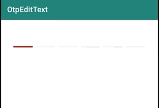

# PassCodeText

[](https://jitpack.io/#swapnil1104/OtpEditText)
[](https://android-arsenal.com/details/1/7666)

A customised EditText view serving the purpose of taking numeric **One Time Password** from a user. 
With stunning animation, and high customizability.



## Packed with features
- Add custom character limit.
- Use your own color scheme.
- Do not allow user changing cursor position for smooth functioning.


## How to integrate the library in your app?
Step 1: Add it in your root build.gradle at the end of repositories:

```
allprojects {
    repositories {
        maven { url "https://jitpack.io" }
    }
}
```
Step 2. Add the dependency

```
dependencies {
    implementation 'com.github.swapnil1104:OtpEditText:{current_lib_ver}'
}
```
Step 3. Add OtpEditText to your layout file

```
<com.broooapps.otpedittext2.OtpEditText
    android:layout_width="match_parent"
    android:layout_height="wrap_content"
    android:clickable="false"
    android:cursorVisible="false"
    android:digits="0123456789"
    android:inputType="number"
    android:maxLength="6"
    android:padding="8dp"
    android:textSize="30sp"
    app:oev_primary_color="@color/red"
    app:oev_secondary_color="@color/light_gray"
    />
```

## How to customize the view.
### Setting desired length for the OTP(One time password code)

To set custom length of the OtpEditText, use 

```android:maxLength="{your length}"```

This will automatically generate the right amount of boxes for user to input the code in.

### Setting primary custom color
The primary color signifies the boundary of the box that requires input from user.
To change that use,

```app:oev_primary_color="@color/{your_color}"```


### Setting secondary custom color
The secondary color signifies the boundary of the boxes that do not require input from user.
To change that use,

```app:oev_secondary_color="@color/{your_color}"```

###  Using multiple style options.
There are 4 style options that are available within the library for now.
- rounded box
- square box
- underline
- rounded underline

To use any of these styles, please add ```app:oev_box_style="@string\{box_style_input}"```
attribue.
I have provided string resources for simpler usage.
```
    <string name="style_square">square_box</string>
    <string name="style_rounded">rounded_box</string>
    <string name="style_underline">underline</string>
    <string name="style_rounded_underline">rounded_underline</string>
```
Suppose you want the rounded underline option to be displayed. Then, please add:
`app:oev_box_style="@string/style_rounded_underline" ` in the OtpEditText xml code.

### Masking input characters with Asterisk.
Functionality to mask the input with any special character has been introduced. 
To mask the input;
```
app:oev_mask_input="true" 
```
xml property must be introduced in the XML layout file.

#### Masking with any other special character.
To mask input with any character other than `*` you can do the following;
```
app:oev_mask_character="ø"
```

P.S. Please note that, in case of masking with a special character other than `*`, specify string with length one, otherwise the input string will be truncated to length 1.

## For optimum usage; Please note.
* Specify `android:textSize` according to your needs.
* Specify `android:padding` according to your needs, there are no paddings drawn by default.
* Specify `android:layout_height` according to the `textSize` you've provided. The view will try to center the text with a vertical biasing of `0.6f`.
